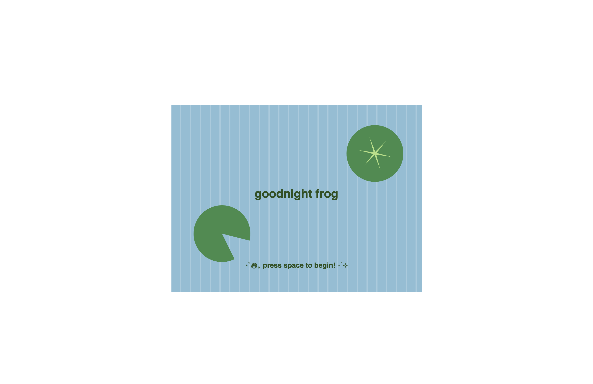
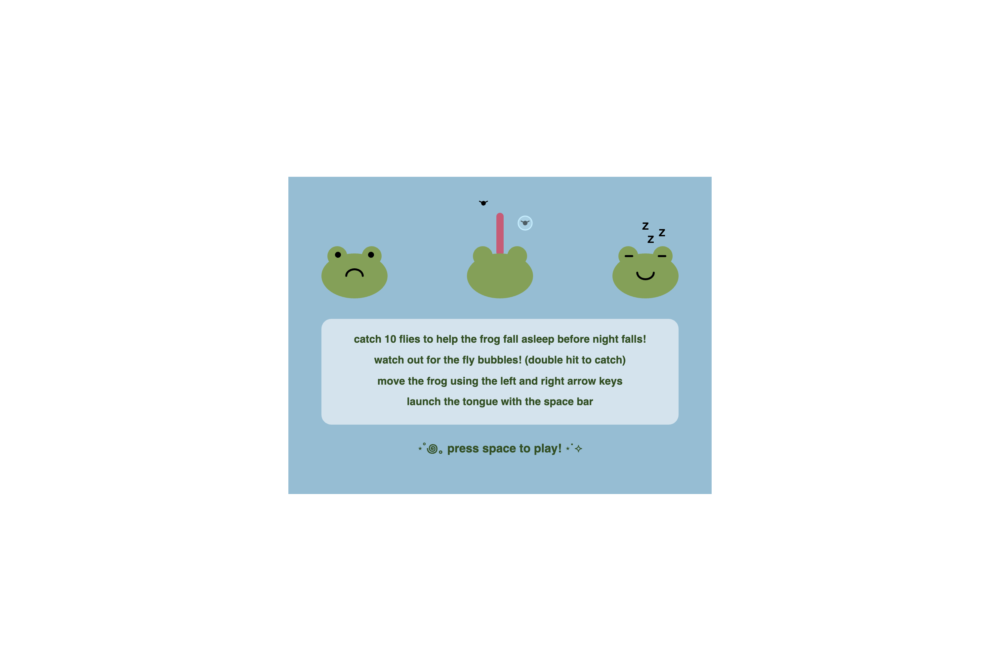
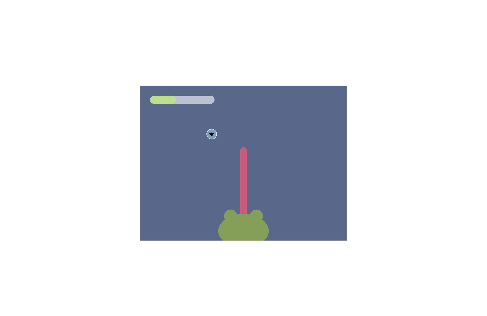
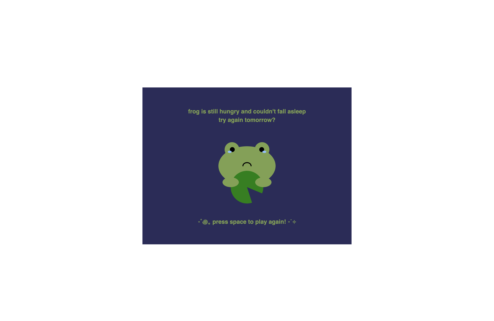
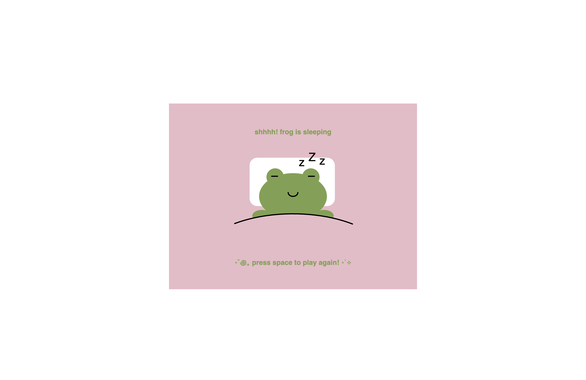

# Mod Jam

Christie Leung

[View this project online](https://christieleung.github.io/cart253/assignments/mod-jam/)

## Description

> *goodnight frog* is a cozy game about a frog who can't fall asleep until their belly is full. Help the frog catch 10 flies before night falls so they can have a peaceful sleep! If not, the frog will stay awake and be hungry until the next morning.

> The experience is controlled via the keyboard, moving the frog using the left and right arrow keys and launching the tongue with the space bar. The space bar also allows the user to change between states. Make sure to hit the flies trapped in bubbles twice to get the catch (the bubble needs to be popped before the fly can be caught)!

## Modifications

> - Title screen with vertical stripes and rotating lily pads
> - Instructions screen with frog diagrams
> - New control system using the keyboard
> - New fly movement using randomized sine waves
> - Added catching complexity by trapping some flies in bubbles
> - Scoring system using a progress bar that fills with each fly caught
> - Timer shown by the sky changing from light blue to dark blue over 30 seconds (didn't include countdown on screen because it made it feel more stressful than cozy)
> - Two ending screens: sleeping frog (win) and hungry frog (lose)
> - Audio effects: background music, sound effects when the fly is caught and the bubble is popped, eerie music for the hungry frog ending

## Screenshots

> 
> 
> 
> 
> 

## Attribution

> This project uses [p5.js](https://p5js.org) and p5.sound.js

> Sounds:
> - The Animal Crossing music is "Animal Crossing City Folk - 1 AM Music", uploaded by John2K7 on YouTube (from the Nintendo game): https://www.youtube.com/watch?v=KnT15ubTRi4 
> - The sparkle sound effect is "sound effect: twinkle/sparkle" by ShidenBeatsMusic from pixabay.com: https://pixabay.com/sound-effects/sound-effect-twinklesparkle-115095/
> - The bubble pop sound effect is "bubble pop 06" by Universfield from pixabay.com: https://pixabay.com/sound-effects/bubble-pop-06-351337/ 
> - The night ambience sound is "night ambience" by cclaretc from pixabay.com: https://pixabay.com/sound-effects/night-ambience-17064/

> Referenced Code:
> - "frogfrogfrog" by Pippin Barr: https://github.com/pippinbarr/frogfrogfrog/blob/main/js/script.js
> - Star function from p5.js: https://archive.p5js.org/examples/form-star.html
> - Sine wave movement from "Wave Movement" by crecord: https://editor.p5js.org/crecord/sketches/ByWfYwbjb

> Other:
> - Emoticons from: https://emojicombos.com/star
> - Key codes from: https://www.toptal.com/developers/keycode

## License

> This project is licensed under a Creative Commons Attribution ([CC BY 4.0](https://creativecommons.org/licenses/by/4.0/deed.en)) license with the exception of libraries and other components with their own licenses.