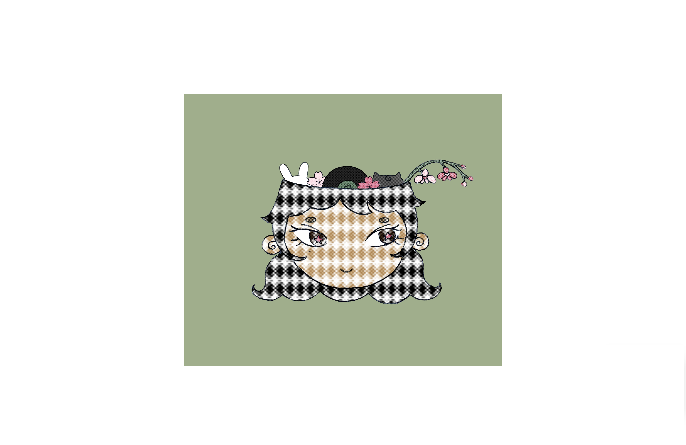
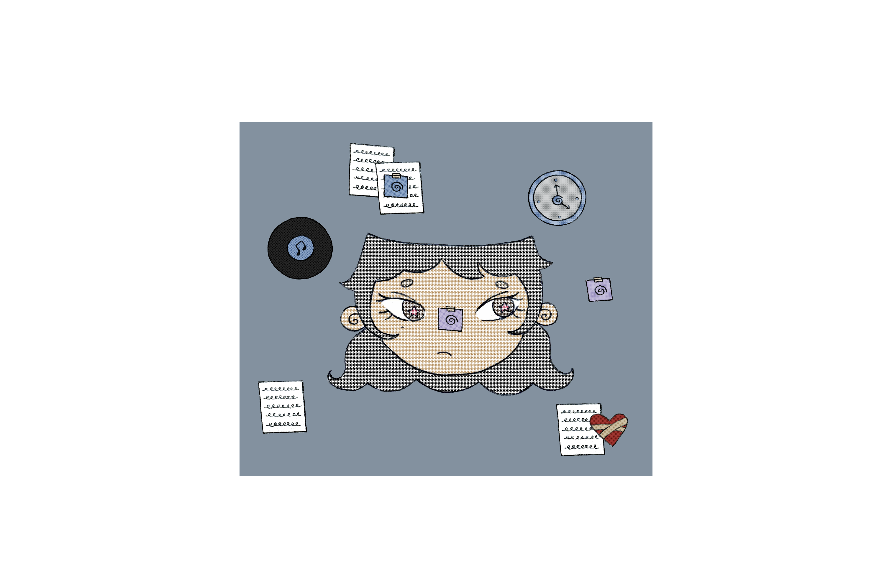
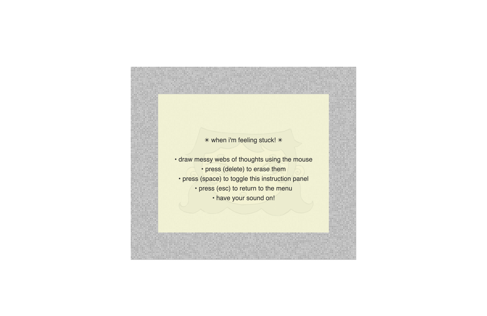
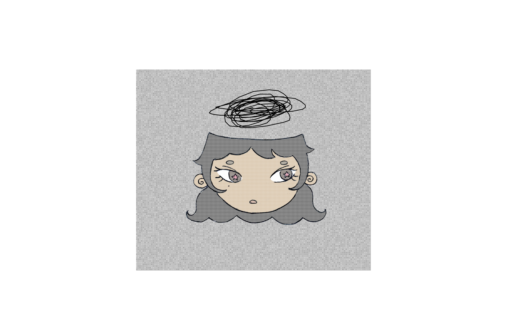

# Variation Jam

Christie Leung

[View this project online](christieleung.github.io/cart253/assignments/variation-jam/)

## Description

> *A peek inside my head!* is project that allows the user to interact with different mental states: daydreaming, anxious, and stuck. 

> The experience is controlled with the mouse, as you can click to bring the different items inside my head to the top, and drag to move them around in the daydreaming and anxious variations. 
>
> The daydreaming variation includes cute animals, a bunny and cat, along with pretty flowers, sakura and an orchid branch. In constrast, the anxious variation is filled with post-it notes (reminders), papers (forms and essays), a bandaged heart (health), and a clock (time). Items in the anxious variation are duplicated to make the state feel more cluttered and overwhelming, and they tremble when dragged. 
> 
> Both variations also include a vinyl record that spins and plays a song that I tend to listen to in those moods. The other items in the daydreaming variation have a sparkle / shimmering sound effect to match the hazy state and stars, while the ones in the anxious variation are more accurate to what the items are, as I become more aware of every sound and action when I feel stressed.
>
> The mouse is also used to draw in the stuck variation. There are no items in this mode, as I feel like I can never think of anything concrete in this state. You can choose to scribble all over the canvas, or leave the space empty, reflecting how it feels when your mind is in a constant loop, with thoughts that simultaneously feel like too much yet nothing at all.

> The project is also controlled using the keyboard, as pressing (1), (2), or (3) allows you to enter the daydreaming, anxious, or stuck variations, and pressing (space) toggles the visibility of each state's instruction panel. Pressing (escape) allows you to return to the menu. And lastly, the drawings in the stuck variation can be cleared by pressing the (delete / backspace) key. 

## Screenshots

> 

> 

> 

> 

> 

## Attribution

> This project uses [p5.js](https://p5js.org)

> Sound effects from pixabay.com:
> - The shimmering sound effect is “Shimmering Object” by opticalillusions (freesound_community): https://pixabay.com/sound-effects/shimmering-object-79354/
> - The clock sound effect is “Clock Ticking Down” by DRAGON-STUDIO: 
> - The paper crinkle sound effect is “Paper Crinkle” by Dallonprofe from pixabay.com: https://pixabay.com/sound-effects/paper-crinkle-291786/
> - The sticky note sound effect is “Turning Book Page” by krnash (freesound_community): https://pixabay.com/sound-effects/turning-book-page-79935/
> - The writing sound effect is “Scribble” by Tomoyo Ichijouji (freesound_community): https://pixabay.com/sound-effects/scribble-6144/
> - The heartbeat sound effect is “Heartbeat sound effect” by ShidenBeatsMusic from: https://pixabay.com/sound-effects/heartbeat-sound-effect-111218/
> - The static sound effect is “TV static noise by yourugor from: https://pixabay.com/sound-effects/tv-static-noise-291374/

> Copyrighted music (sorry!):
> - “Crimson and Clover” cover by The Shacks, downloaded from youtube.com: https://www.youtube.com/watch?v=5sUeNgPLijE
> - “Who Knows” by Daniel Caesar, downloaded from youtube.com: https://www.youtube.com/watch?v=glscfhJyZHo&list=RDglscfhJyZHo&start_radio=1

> Referenced code:
> - Cursor trail from “heart cursor copy” by dorianraev: https://editor.p5js.org/dorianraev/sketches/szGPYRZEQ
> - Star helper function from p5.js: https://archive.p5js.org/examples/form-star.html
> - Spiral helper function from “How to create a Rotating Spiral Animation Effect using p5.js?” by geeksforgeeks: https://www.geeksforgeeks.org/javascript/how-to-create-a-rotating-spiral-animation-effect-using-p5-js/
> - Static background design from “Static noise” by Sekvi: https://editor.p5js.org/Sekyi/sketches/rb6qBfKB3
> - Mouse-drawing function from “mouse-drawing” by brain: https://editor.p5js.org/brain/sketches/ojB-QN8Tv

> Other:
> - Key codes from: https://www.toptal.com/developers/keycode

## License

> This project is licensed under a Creative Commons Attribution ([CC BY 4.0](https://creativecommons.org/licenses/by/4.0/deed.en)) license with the exception of libraries and other components with their own licenses.